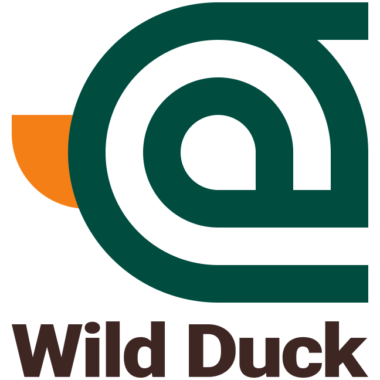

# WildDuck Mail Server

  

  WildDuck is a scalable no-SPOF IMAP/POP3 mail server. WildDuck uses a distributed database (sharded + replicated MongoDB) as a backend for storing all data, including emails.
   
  WildDuck tries to follow Gmail in product design. If there's a decision to be made then usually the answer is to do whatever Gmail has done.

  
  
  

## Links

- [Website](https://wildduck.email)
- [Documentation](https://docs.wildduck.email)
- [Installation instructions](https://docs.wildduck.email/#/general/install)
- [API Documentation](https://docs.wildduck.email/api)

## Contact 

## License

WildDuck Mail Agent is licensed under the [European Union Public License 1.1](http://ec.europa.eu/idabc/eupl.html) or later.

---

## Logo

Simple at-sign with beak

### Sampling Image

    

Base color from [Materialize Color](https://materializecss.com/color.html)

1. Head beauty color **teal darken-4**: `#004d40`
1. Beak color **yellow darken-4**: `#f57f17`
1. Body color **brown darken-4** `#3e2723`

### Type

Use Roboto font as open source and materialize standard font.

### Tools

We use this tools for create logos and optimize them.

- [node.js](https://nodejs.org/)
- [inkscape](https://inkscape.org/)
- [gimp](https://www.gimp.org/)
- [imagemagick](https://imagemagick.org/)
- [pngquant](https://pngquant.org/)